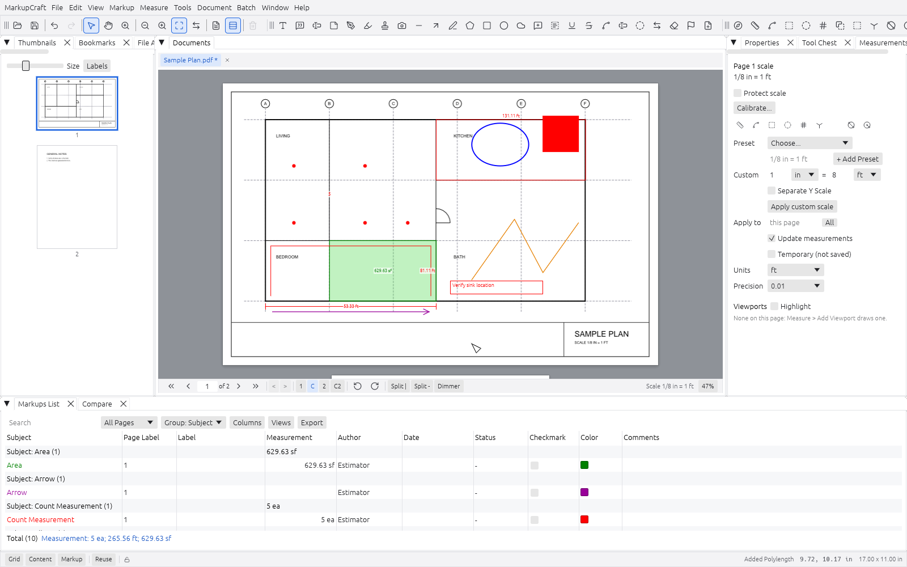
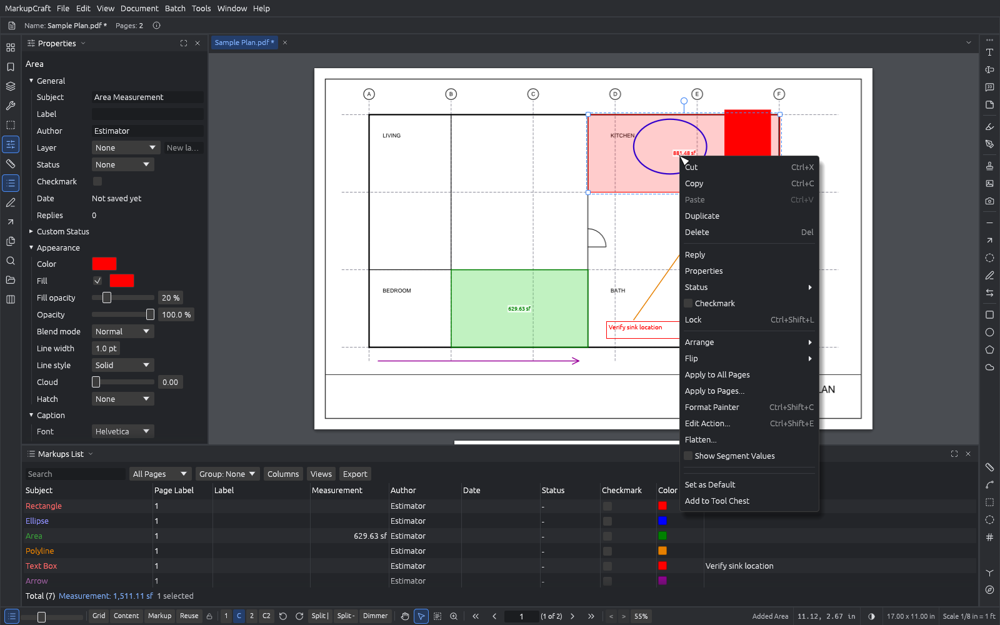
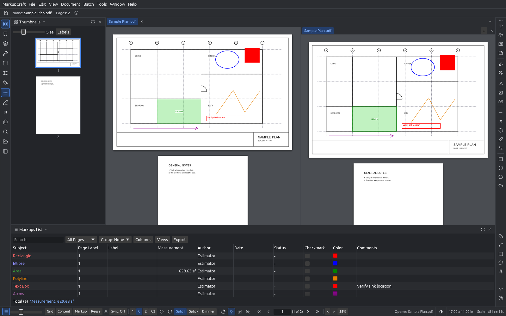
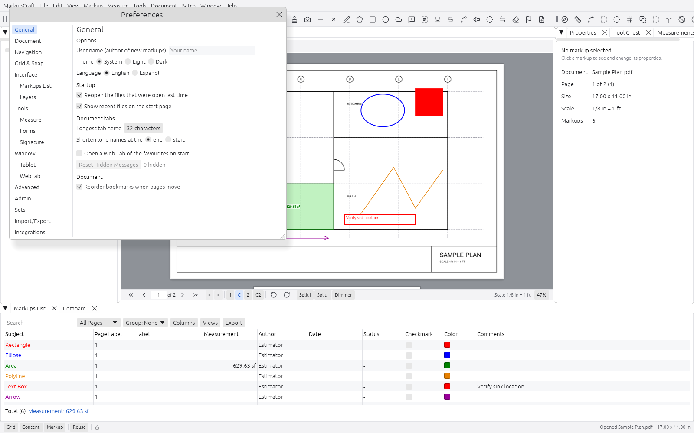

<p align="center">
  
</p>

<h1 align="center">MarkupCraft</h1>

<p align="center">
  <b>PDF markup and quantity takeoff; an open-source, clean-room app that reads and writes Revu-compatible markups, written in Rust.</b><br>
  Mark up drawings, set scales, measure lengths, areas and counts, total them in the Markups List, and hand the same PDF back to anyone on the job.<br>
  Windows · macOS · Linux · the web
</p>

<p align="center">
  
  
  
  
  
</p>

<p align="center">
  <a href="https://github.com/engr-software/markupcraft/releases"><b>Download</b></a> ·
  <a href="FEATURES.md">Every feature, row by row</a> ·
  <a href="CHANGELOG.md">Changelog</a>
</p>

<br>

<p align="center">
  
  <br>
  <sub>A takeoff on the built-in sample plan: Measurements panel on the right, the Markups List grouped by subject with running totals below.</sub>
</p>

> [!NOTE]
> MarkupCraft is an independent, clean-room project. It is **not affiliated with, endorsed by or
> sponsored by Bluebeam, Inc.** Bluebeam and Revu are trademarks of their respective owners and are
> named here only to describe file compatibility. See [Clean-room and trademarks](#clean-room-and-trademarks).

<p align="center">
  <a href="#highlights">Highlights</a> ·
  <a href="#downloads">Downloads</a> ·
  <a href="#screenshots">Screenshots</a> ·
  <a href="#features">Features</a> ·
  <a href="#where-it-stands">Status</a> ·
  <a href="#compatibility-scorecard">Scorecard</a> ·
  <a href="#command-line">CLI</a> ·
  <a href="#built-for-agents-too">MCP</a> ·
  <a href="#build-from-source">Build</a> ·
  <a href="#how-its-built">How it's built</a> ·
  <a href="#license">License</a>
</p>

---

## Highlights

<table>
<tr>
<td width="33%" valign="top">

### Compatible
Markups and measurements are saved as standard PDF annotations with the keys Revu reads and
writes, so a set marked up in MarkupCraft opens in Revu and the other way round, and any PDF
viewer shows the markups.

</td>
<td width="33%" valign="top">

### Measured
Every quantity is computed from geometry and the page scale, then checked against the label Revu
itself saved: 410 of 410 measurements on a real 121-sheet marked-up set. See the
[scorecard](#compatibility-scorecard).

</td>
<td width="33%" valign="top">

### Yours
No account, no telemetry, no cloud. Works offline. The engine, the command-line tool, the MCP
server and the app are all open source.

</td>
</tr>
</table>

---

## Downloads

Every version is on the **[Releases page](https://github.com/engr-software/markupcraft/releases)**,
as three releases, one per operating system (`vX.Y.Z-windows`, `vX.Y.Z-macos`, `vX.Y.Z-linux`).
`<ver>` in the file names is the version number, and each release has a `SHA256SUMS.txt`.

| OS | File | Notes |
|---|---|---|
| Windows 10/11 (x64) | `markupcraft-<ver>-windows-x64-setup.exe` | Installer: Start menu entry, "Open with" for PDFs, uninstaller |
| | `markupcraft-<ver>-windows-x64.zip` | Portable: unzip anywhere, run `markupcraft.exe`; includes `markupcraft-cli.exe` |
| macOS 11+ (Apple silicon) | `markupcraft-<ver>-macos-arm64.dmg` | Drag MarkupCraft to Applications |
| Linux (x86_64) | `markupcraft-<ver>-linux-x86_64.AppImage` | `chmod +x` and run (needs FUSE 2, or `--appimage-extract-and-run`) |
| | `markupcraft-<ver>-linux-x86_64.tar.gz` | Unpack and run `bin/markupcraft`; `.desktop` entry and icons under `share/` |

- **Windows:** the builds are not code-signed yet. If SmartScreen shows a prompt, choose
  **More info**, then **Run anyway**.
- **macOS:** the builds are not notarized yet. The first time, right-click the app and choose
  **Open** (on macOS 15 and later, System Settings > Privacy & Security > **Open Anyway**).
- **Linux:** needs glibc 2.35 or newer and the usual desktop libraries (GTK 3, Wayland or X11,
  Vulkan or OpenGL).

---

## Screenshots

Every screenshot here is MarkupCraft itself, captured headlessly from the real interface with the
`shot` example on the synthetic sample plan that ships in the source (see
[Regenerating the screenshots](#regenerating-the-screenshots)).

<table>
<tr>
<td width="50%"></td>
<td width="50%"></td>
</tr>
<tr>
<td align="center"><sub>Clouds, callouts, highlights and stamps, with the Tool Chest</sub></td>
<td align="center"><sub>The right-click menu and the Properties panel on an Area</sub></td>
</tr>
<tr>
<td width="50%"></td>
<td width="50%"></td>
</tr>
<tr>
<td align="center"><sub>Split views, each pane with its own tabs</sub></td>
<td align="center"><sub>Preferences, organized the way Revu users expect</sub></td>
</tr>
</table>

---

## Features

MarkupCraft follows Revu's commands, menus, panels and default shortcuts, so a Revu user can sit
down and work. Every feature is an engine call first, then a tool for the CLI and MCP, then the
interface. The full list, one row per feature with its test and its acceptance verdict, is
**[FEATURES.md](FEATURES.md)**.

### Markups

- Lines, arrows, polylines, polygons, rectangles, ellipses, arcs, dimensions, clouds and Cloud+,
  text boxes, callouts, typewriter text, notes, pen and highlighter, eraser, lasso, flags, file
  attachments, images and snapshots.
- Text markups: highlight, underline, strikethrough, squiggly, insert and replace text.
- Stamps with a stamp library, interactive stamp fields and symbols; hatch patterns, line styles,
  line endings, opacity and blend modes, rich text, live spell check.
- Properties panel with mixed-value editing, Format Painter, align, distribute, flip, rotate,
  group, lock, layers, replies, review status and checkmarks.
- The **Tool Chest**: recent tools, My Tools, tool sets you can share, Set as Default.
- Saved with appearance streams, so every PDF viewer shows them; flatten and unflatten.

### Measurement and takeoff

- **Scales:** calibrate, architectural, engineering and metric presets, custom scales, your own
  presets, a separate Y scale, per-page scales and **viewports** with their own scales.
- **Tools:** Length, Polylength, Perimeter, Area (with cutouts and arcs), Volume, Count (with
  symbols and series), Diameter, Radius, Angle, Slope, Rise/Drop, and **Dynamic Fill**.
- **Captions** placed where Revu places them, caption templates, segment values, precision and
  fractional or decimal display in imperial or metric units.
- Snap to content, to markups and to the grid; Sketch to Scale; Recalculate after a scale change.
- **Spaces** (rooms) with counts split by space, **legends**, Quantity Link to Excel, count status
  reports.

### Markups List

- Every markup in a table: sort, filter, search, group by any column, totals per unit and per group.
- Custom columns (text, number, currency, date, choice, formula), stored with the document, so the
  file is the project.
- Saved views; summaries to CSV, XML, Excel and PDF, appended to an existing workbook or sent to
  the printer.

### Documents

- Tabs, continuous and single-page views, split views up to 16 panes, rulers, crosshair, dimmer,
  view history, full screen and presentation.
- Thumbnails, bookmarks (with bookmarks from source), page labels, links, attachments, document
  properties.
- Insert, delete, extract, replace, rotate, crop, split and combine pages; create PDFs from images,
  text, Word, Excel, PowerPoint and DXF; PDF packages; headers and footers, watermarks, Bates
  numbering; reduce file size, PDF/A-1b, print-ready PDF and printing with live preview.

### Review: Compare, Overlay, Search

- **Compare Documents** with change clouds (markup text is left out unless you ask), **Overlay
  Pages** and Smart Overlay with color shading, and Align to Reference.
- **Search** text, markups, properties and form fields, then highlight, redact, link, bookmark
  or count what it finds; **Visual Search** for repeated symbols; OCR on a worker thread.

### Batch

- A background job queue for Batch Link, Batch Slip Sheet (pairing, superseded pages, reports),
  Batch Summary, Batch Compare, Batch Overlay, Batch Flatten/Unflatten, Batch Apply Stamp, Batch
  Sign and Seal, Batch Split, Batch Print and scripts.
- **Sets** of documents with their own navigation.

### Forms, signatures and security

- Fill and author AcroForm fields, XFA forms, form data import and export, document JavaScript
  from trusted folders with a console.
- Digital IDs, signing with an image appearance, certification, signature validation.
- Passwords and permissions with security presets; redaction by area or by search, with
  redaction properties, then applied.

### Interface

- Revu's menus, toolbars, panels and **every default keyboard shortcut**, a shortcut editor, named
  toolbars, detached and docked panels, saved layouts and shipped profiles.
- Preferences pages for General, Document, Navigation, Grid and Snap, Interface, Tools, Window,
  Tablet, Advanced, Admin and more; light and dark modes; an English and Spanish interface; its own
  help (F1); recovery after a crash and safe saves (temporary file, then rename).

---

## Where it stands

MarkupCraft is **alpha** software at version 0.4.0. Honestly:

- **Parity table.** The clean-room inventory of Revu 21's features has **946 rows**. **41** are
  out of scope (below). Of the **905** in scope, **891** are built and tested (**2** of them
  proven against a recording of real Revu, **889** built from documentation) and **14** are
  partial. None is missing. Per area, in [FEATURES.md](FEATURES.md#totals):

  | Area | In scope | Have / proven | Partial | Acceptance: pass | fixed | gap |
  |---|---|---|---|---|---|---|
  | Measurement and takeoff | 134 | 134 | 0 | 123 | 11 | 0 |
  | Markups, Properties, Tool Chest, layers, Markups List | 192 | 190 | 2 | 172 | 16 | 4 |
  | Documents, pages, batch, print, search, security | 211 | 206 | 5 | 173 | 33 | 5 |
  | Compare/overlay, interface, preferences, mouse | 195 | 189 | 6 | 149 | 39 | 7 |
  | Default keyboard shortcuts | 173 | 172 | 1 | 160 | 13 | 0 |
  | **All** | **905** | **891** | **14** | **777** | **112** | **16** |

- **Blind acceptance.** Every in-scope row also has an acceptance test written from the inventory
  text by someone who did not build the feature, driving the real tools and the real interface:
  **777 passed** as built, **112 found a bug that is now fixed** (each with a regression test) and
  **16 are known gaps**. How it works: [docs/EQUIVALENCE.md](docs/EQUIVALENCE.md#blind-acceptance-testing).
- **Proof.** Only measurement quantities and page scales are **proven** against Revu itself.
  Several storage choices (Count, Perimeter, Diameter, Radius, Angle, Dimension and Arc layouts,
  cutouts, some caption placements, custom columns) are MarkupCraft's best reading of the public
  documentation and still need a recording of real Revu; they are listed in
  [docs/EQUIVALENCE.md](docs/EQUIVALENCE.md#guesses-still-needing-a-revu-recording). Until then a
  markup of those kinds made in MarkupCraft may look or list differently in Revu.

**Deliberately excluded** (not counted): Studio Sessions and Studio Projects, Bluebeam Cloud,
document management systems (SharePoint and others), Revu's Office and CAD authoring plugins, and
3D PDF.

**Known gaps** (the 16 `gap` rows):

- **Proprietary formats with no public specification:** Revu tool sets (`.btx`) and BAX markup
  exports are not read or written (MarkupCraft uses its own `.mctools` and XFDF / FDF); binary DWG
  is not read (save as DXF).
- **Hardware:** scanners only over the network (eSCL / AirScan), not TWAIN, WIA or SANE drivers;
  the camera takes still pictures only (and is an opt-in build feature); no 3D mouse.
- **External services:** no embedded web browser (the Web Tab opens pages in your browser or
  captures them to PDF), no machine translation of markup text, no DMS settings.
- **Smaller differences** in some preferences pages (Tablet, 2D Rendering, Markup, Admin) and in
  OCR and print-dialog options; each row's notes say exactly what differs.

---

## Compatibility scorecard

The scorecard is the project's proof of compatibility with files Revu made. It runs
`markupcraft-cli` over a real set of drawings marked up in Revu (not included in this repository)
and counts:

| Step | What it checks | Today |
|---|---|---|
| `check` | our quantity for every measurement equals the label Revu saved | 410/410 |
| `resave` | every measurement survives a full rewrite and reload with the same quantity | 410/410 |
| `markupcheck` | every other markup survives a rewrite and reload unchanged (geometry, text, colors, style) | 187/187 |

Point `MARKUPCRAFT_REF_PDF` at any Revu-marked set of your own to run it:

```sh
MARKUPCRAFT_REF_PDF=/path/to/marked-up-set.pdf cargo xtask scorecard
```

Without `MARKUPCRAFT_REF_PDF` the scorecard, and the end-to-end takeoff test that uses the same
variable (`cargo test -p markupcraft-acceptance --test real_world`), are skipped. Thresholds can
be changed with `--check N --resave N --markupcheck N` (or `MARKUPCRAFT_SCORE_CHECK`, `_RESAVE`,
`_MARKUPCHECK`). The set never enters the repository, and nothing about it (name, path, text) is
printed. How behavior is proven beyond the scorecard: [docs/EQUIVALENCE.md](docs/EQUIVALENCE.md);
the real-world takeoff test, the benchmark and the fuzzer: [docs/hardening.md](docs/hardening.md).

---

## Command line

`markupcraft-cli` uses the same engine as the app:

```text
markupcraft-cli list <pdf> [--csv out.csv]          markups and totals per subject
markupcraft-cli summary <pdf> --csv s.csv [--group subject] [--totals t.csv] [--xml s.xml]
markupcraft-cli check <pdf>                         our quantities vs the label Revu saved
markupcraft-cli resave <in.pdf> <out.pdf>           rewrite every measurement, reload, compare
markupcraft-cli markupcheck <in.pdf> <out.pdf>      rewrite every other markup, reload, compare
markupcraft-cli pages <in.pdf> <out.pdf> rotate|delete|move|blank|insert|extract ...
markupcraft-cli tools [--json]                      every automation tool and its JSON Schema
markupcraft-cli run <tool> key=value ... [--root DIR]
markupcraft-cli run --script steps.json [--root DIR]
markupcraft-cli mcp [--root DIR] [--author NAME]    the MCP server on stdin/stdout
```

It exits 0 when everything matched, 1 when something differs or fails, and 2 on a usage error.

A takeoff as a script (`steps.json`): open a plan, set 1/8" = 1'-0", draw a 10 ft x 10 ft area,
export the summary and save:

```json
[
  { "tool": "doc_open",       "params": { "path": "plan.pdf" } },
  { "tool": "scale_set",      "params": { "pages": [1], "scale": { "kind": "architectural", "paper_inches": 0.125, "real_feet": 1 } } },
  { "tool": "markup_add",     "params": { "page": 1, "kind": "Area", "points": [[100, 100], [190, 100], [190, 190], [100, 190]] } },
  { "tool": "summary_export", "params": { "out": "takeoff.csv" } },
  { "tool": "doc_save",       "params": { "path": "plan-takeoff.pdf", "full": true } }
]
```

```sh
markupcraft-cli run --script steps.json --root ./job      # every file stays inside ./job
```

## Built for agents, too

Every feature is reachable without the interface, through one table of JSON-Schema-described
tools (about 260 of them: documents, pages, markups, scales, measurements, the Markups List,
summaries, search, compare, batch, forms, signatures, security and more). Three front doors share
it: `markupcraft-cli run`, the Rust API (`markupcraft_automation::Automation::call`), and an
**MCP server** for AI agents.

**The MCP server is opt-in.** MarkupCraft never starts it on its own and it opens no network
port: it runs only while an agent launches `markupcraft-cli mcp`, talks over stdin/stdout, and
stops when the agent disconnects. Add it to your agent's MCP configuration:

```json
{ "mcpServers": { "markupcraft": { "command": "markupcraft-cli", "args": ["mcp", "--root", "/path/to/your/drawings"] } } }
```

`--root` confines every file the agent can read or write to one folder; `--author` sets the
author written on new markups. Edits stay in memory and undoable until `doc_save`, and saves are
atomic.

---

## Web build

The same app runs in a browser (WebAssembly + WebGL 2). It is not hosted anywhere; build it and
serve it yourself:

```sh
rustup target add wasm32-unknown-unknown
cargo install trunk --locked                # or: cargo install wasm-bindgen-cli --version <Cargo.lock's wasm-bindgen> --locked
cargo xtask web                             # the site in dist-web/ (--no-trunk uses wasm-bindgen directly)
python -m http.server -d dist-web 8767      # then open http://127.0.0.1:8767/
```

Open PDFs with File > Open (the browser's file picker) or by dropping them on the window, or
link one with `?file=<url>` (same origin or CORS-enabled). Save and exports download the file;
settings stay in the browser's storage. Printing to a system printer, camera and scanner,
email, shell integration and the Web Tab need the desktop app and are greyed out; pages render
on the interface thread. CI builds the bundle and uploads it as the `markupcraft-web` artifact.

---

## Build from source

You need Rust 1.95 or newer ([rustup.rs](https://rustup.rs)). On Linux, also the windowing and
GTK development packages:

```sh
# Debian / Ubuntu
sudo apt install libxkbcommon-dev libwayland-dev libx11-dev libxcursor-dev libxrandr-dev \
  libxi-dev libgl1-mesa-dev libgtk-3-dev
```

```sh
git clone https://github.com/engr-software/markupcraft
cd markupcraft
cargo run --release -p markupcraft                        # the desktop app
cargo run --release -p markupcraft-cli -- list drawing.pdf
cargo test --workspace                                    # unit, UI and acceptance tests
cargo xtask parity --check                                # the parity table and its evidence
cargo xtask ci                                            # fmt, clippy, tests, wasm check, parity
cargo xtask package                                       # this OS's packages into dist/
```

OCR models are fetched on demand with `cargo xtask models` (checked by SHA-256, never committed).
Project tasks run through `cargo xtask` (`cargo xtask help` lists them). Releases are described in
[docs/releasing.md](docs/releasing.md).

### Regenerating the screenshots

The screenshots are rendered headlessly from the real interface (egui_kittest + wgpu, no window)
on the synthetic sample plan, which is generated in code; no project drawing is involved. For
example, the takeoff screenshot:

```sh
cargo run -p markupcraft-ui-egui --example shot -- docs/images/markupcraft-takeoff.png \
  --zoom fit-page --panel measurements --group-by subject \
  --tool length --click 120,165 --click 600,165 \
  --then-tool count --click 200,560 --click 400,560 --click 200,400 --click 400,400 --click 520,400 --key Enter \
  --then-tool perimeter --click 600,520 --click 1020,520 --click 1020,690 --click 600,690 --dblclick 600,690 \
  --then-tool polylength --click 135,195 --click 135,335 --click 585,335 --dblclick 585,195 \
  --then-tool select --key Escape --hover 700,60
```

Points are PDF user space on the current page. `--panel`, `--tool`, `--show N` (select markup N),
`--rclick X,Y`, `--drag X1,Y1,X2,Y2`, `--type TEXT` and `--run COMMAND` (for example
`window.preferences` or `view.split_vertical`) cover the rest. Set `MARKUPCRAFT_USER` (and
`USERNAME` / `USER`) to a neutral name first, since new markups carry the author's name.

---

## How it's built

MarkupCraft follows the conventions of the Crafting Apps family
([PdfCraft](https://github.com/storytold/pdfcraft), PhotoCraft): a Rust workspace with `apps/`,
`crates/` and `xtask/`, an egui + wgpu interface on top of a headless engine, and a never-crash
rule for every input. It builds on PdfCraft's PDF object layer and page renderer.

| Crate | What it does |
|---|---|
| `markupcraft-geom` | points, polygons, snapping index, text metrics |
| `markupcraft-measure` | units, scales, number formats, quantities and their label text |
| `markupcraft-model` | the markup model: kinds, properties, captions, columns |
| `markupcraft-revu` | reading and writing Revu-compatible annotations and appearance streams |
| `markupcraft-render` | page rendering, tiles, snapping linework, the synthetic sample plan |
| `markupcraft-engine` | sessions, undo, saving and every document, review and batch feature |
| `markupcraft-automation` | the tool table behind `markupcraft-cli run`, the MCP server and the app |
| `markupcraft-ui-egui` | the desktop and web interface |
| `markupcraft-acceptance` | blind acceptance tests, one per feature |

```
apps/      markupcraft (desktop), markupcraft-cli, markupcraft-web (WASM)
crates/    geom, measure, model, revu, render, engine, automation, ui-egui, acceptance
xtask/     ci, scorecard, parity, bench, fuzz, models, package
packaging/ per-OS package scripts and release notes
```

**Quality gates.** Every commit passes `cargo fmt --all --check`, Clippy with warnings as errors,
the whole test suite (unit, headless UI and acceptance tests) and `cargo xtask parity --check`,
which rejects any feature row whose evidence or acceptance test does not exist. Every PDF, script,
tool call, settings file and keystroke is treated as untrusted input: no `unsafe`, no panics on
input, and saves write a temporary file and then rename it. See
[docs/ARCHITECTURE.md](docs/ARCHITECTURE.md), [docs/ARTCRAFT_FORMAT.md](docs/ARTCRAFT_FORMAT.md)
and [docs/hardening.md](docs/hardening.md).

## Clean-room and trademarks

MarkupCraft is an independent project, written from public documentation (ISO 32000 and Revu's
public help), PDFs we own read with a PDF parser, and black-box observation. Nothing from a
Bluebeam installation is decompiled, disassembled or copied, and no Bluebeam code, icons, artwork,
fonts, sample files, stamps or screenshots are used; MarkupCraft's icons and visual design are its
own. It is not affiliated with, endorsed by or sponsored by Bluebeam, Inc.

## License

Licensed under either of [Apache License, Version 2.0](LICENSE-APACHE) or [MIT license](LICENSE-MIT)
at your option. Unless you explicitly state otherwise, any contribution intentionally submitted
for inclusion in MarkupCraft, as defined in the Apache-2.0 license, shall be dual licensed as
above, without any additional terms or conditions.

Third-party components and assets, including the screenshots in `docs/images/`, are listed in
[THIRD_PARTY.md](THIRD_PARTY.md).

<sub>Bluebeam and Revu are trademarks or registered trademarks of Bluebeam, Inc. Microsoft, Windows, Word, Excel, PowerPoint and SharePoint are trademarks of Microsoft Corporation. Apple and macOS are trademarks of Apple Inc. All other trademarks belong to their respective owners. MarkupCraft is an independent, open-source project and is not affiliated with, sponsored by or endorsed by any of them; these names are used only to describe compatibility.</sub>
